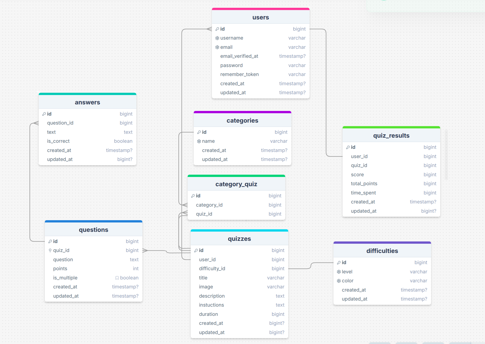

# Quiz Wiz Back-End

A Laravel-based backend API for the QuizWiz platform — an interactive quiz application featuring authentication, quiz progress tracking, filtering, sorting, and an administrative dashboard. The backend is built to support a modern SPA frontend (such as Vite + React) and adheres to RESTful standards.

## Table of Contents

- [Introduction](#introduction)
- [Prerequisites](#prerequisites)
- [Tech Stack](#tech-stack)
- [Getting Started](#getting-started)
- [Development](#development)
- [Deployment](#deployment)
- [Resources](#resources)

## Introduction

QuizWiz is a quiz platform where users can find, take, and track quizzes.  
This repository contains the backend API, which is responsible for:

- User login and access control
- Creating and managing quizzes, questions, and answers
- Saving quiz attempts, time spent, and progress
- Filtering, searching, and sorting quizzes
- Showing quizzes based on user status (completed or not completed)
- An admin panel for managing the application

The application includes an admin dashboard built with Filament and uses Laravel Sanctum for secure API authentication.

## Prerequisites

Make sure you have the following installed:

- PHP 8.2+

- Composer 2.x

- Node.js 18+ and npm

- Database (MySQL 8+, SQLite, or PostgreSQL)

## Tech Stack

- Framework: Laravel 12.x

- Authentication: Laravel Sanctum

- Admin Panel: Filament v4

## Getting Started

This section will guide you to set up the QuizWiz backend locally, seed the database, and run the API so your frontend can connect to it.

### 1. Clone the Repository

```sh
git clone https://github.com/RedberryInternship/levan-mchedlishvili-quiz-wiz-back.git
cd levan-mchedlishvili-quiz-wiz-back
```

### 2. Install Dependencies

```sh
composer install
npm install
```

### 3. Configure Environment

Copy the example .env file and update it with your local environment:
```sh
cp .env.example .env
```

Edit .env:
```sh
APP_NAME=QuizWiz
APP_ENV=local
APP_KEY=base64:GENERATED_KEY
APP_DEBUG=true
APP_URL=http://localhost:8000

DB_CONNECTION=mysql
DB_HOST=127.0.0.1
DB_PORT=3306
DB_DATABASE=quiz_wiz
DB_USERNAME=root
DB_PASSWORD=secret

SANCTUM_STATEFUL_DOMAINS=localhost:5173
SESSION_DOMAIN=localhost
```

Make sure APP_KEY is generated:
```sh
php artisan key:generate
```


### 4. Run Database Migrations & Seeders

Make sure your database exists. Then run:
```sh
php artisan migrate
php artisan db:seed
```

This will create all tables and populate them with sample data for quizzes, questions, and users.

### 5. Create Storage Link (Optional)

If your project serves images from storage:
```sh
php artisan storage:link
```

### 6. Start the Backend Server
```sh
php artisan serve
```
By default, the backend API will be available at:
```sh
http://localhost:8000
```

### 7. Test the API

Open your browser or use Postman to test endpoints like:
```sh
GET http://localhost:8000/api/quizzes
```


### 💡 Tips:

Always clear caches after changing .env:
```sh
php artisan config:clear
php artisan cache:clear
php artisan route:clear
```

If connected to your SPA frontend (e.g., React), make sure SANCTUM_STATEFUL_DOMAINS in .env matches your frontend domain (localhost:3000).

## Development

During development, the following steps and practices should be considered to ensure smooth coding, testing, and collaboration:

### 1. Start the Development Server

Run the Laravel development server:
```sh
php artisan serve
```

The API will be available at http://localhost:8000.


### 2. Watch for Frontend Asset Changes (if using Vite or similar tool)

If you have frontend assets (JS/CSS) that need compiling, keep the watch process running:
```sh
npm run dev
```

This ensures any changes in your JS, CSS, or Blade templates are automatically reflected in the browser.

### 3. Database Management

Run migrations after schema changes:
```sh
php artisan migrate
```

Reset database during development if needed:
```sh
php artisan migrate:fresh --seed
```

Always back up important data before resetting.


## Deployment

To deploy the project from development to a production server:

### 1. Prepare Production Server

Connect via SSH:
```sh
ssh user@your-server-ip
```

Navigate to your deployment folder:
```sh
cd /home/user/apps/quiz-wiz-back
```

Ensure Git is installed on the server.

### 2. Pull the Latest Code

You can use Git to update the server:
```sh
git pull origin main
```

### 3. Install Dependencies on Server
```sh
composer install 
npm install 
```

### 4. Configure Environment

Copy .env.production or update .env with production settings.

Make sure database, APP_URL, and SANCTUM_STATEFUL_DOMAINS are correct.

### 5. Clear and Cache
```sh
php artisan config:cache
php artisan route:cache
php artisan view:cache
```

This improves performance and ensures latest configurations are used.

### 6. Configure Nginx 

Create or edit your site configuration for Laravel:
```sh
sudo nano /etc/nginx/sites-available/quiz-wiz-back
```

### 7. Restart Services

After configuring Nginx and PHP-FPM:
```
sudo systemctl restart php8.2-fpm
sudo systemctl restart nginx
```

## Resources

- Database Diagram

